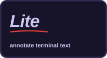

# herdr-annotate
Annotate inside [Herdr](https://github.com/herdrdev/herdr): comment on any terminal text, review whole Markdown documents and your agent's replies, and send the feedback straight back to the agent. Document review is powered by [plannotator-tui](https://github.com/plannotator/plannotator-tui), which also runs on its own outside Herdr.

<p align="center">
  <a href="https://github.com/backnotprop/plannotator">
    
  </a>
</p>

**Watch the demos**

[](https://x.com/plannotator/status/2093419561077154287)
[](https://x.com/plannotator/status/2092757422322627008)

## Requirements

- Herdr 0.8.0 or later
- [Bun](https://bun.sh/)
- macOS, Linux, or Windows

On Linux, install `wl-clipboard`, `xclip`, or `xsel` for clipboard access.

On Windows, native Herdr plugin support is preview/best-effort. Bun must be on `PATH`. Clipboard access uses PowerShell; no extra clipboard package is required. The install, keybinding, configuration check, reload, and use instructions below also apply on Windows.

## Install

Pick one. Installing the other later just swaps it (same plugin id).


**Full:** annotate terminal text, review documents and agent replies, send feedback to the agent.
Wraps [Plannotator TUI](https://github.com/plannotator/plannotator-tui) (macOS and Linux today).

```sh
herdr plugin install plannotator/herdr-annotate
```

<br clear="all">



**Lite:** the simple version: select text, `prefix+a`, comment in a popover.

```sh
herdr plugin install plannotator/herdr-annotate/lite
```

<br clear="all">

> **Required.** Bind the keys in Herdr's config.

<details open>
<summary><b>Full install keys:</b> terminal annotations + document and agent-reply review</summary>

```toml
# Terminal annotations
[[keys.command]]
key = "prefix+a"
type = "plugin_action"
command = "annotate.capture"
description = "annotate text"

[[keys.command]]
key = "prefix+shift+a"
type = "plugin_action"
command = "annotate.copy-context"
description = "copy annotations as context"

[[keys.command]]
key = "prefix+m"
type = "plugin_action"
command = "annotate.manage"
description = "manage annotations"

# Document review (plannotator-tui)
[[keys.command]]
key = "prefix+o"
type = "plugin_action"
command = "annotate.open"
description = "review documents in this folder"

[[keys.command]]
key = "prefix+shift+o"
type = "plugin_action"
command = "annotate.last"
description = "review the agent's last reply"
```

</details>

<details>
<summary><b>Lite install keys:</b> terminal annotations only</summary>

```toml
[[keys.command]]
key = "prefix+a"
type = "plugin_action"
command = "annotate.capture"
description = "annotate text"

[[keys.command]]
key = "prefix+shift+a"
type = "plugin_action"
command = "annotate.copy-context"
description = "copy annotations as context"

[[keys.command]]
key = "prefix+m"
type = "plugin_action"
command = "annotate.manage"
description = "manage annotations"
```

</details>

Check and reload:

```sh
herdr config check
herdr server reload-config
```

## Use

### Annotate terminal text

| Key | Action |
|---|---|
| `Ctrl+B A` | comment on the selected text · `Ctrl+S` saves |
| `Ctrl+B Shift+A` | copy all annotations as Markdown |
| `Ctrl+B M` | manage · `y` copy one · `c` copy all · `Shift+C` copy and archive · `Tab` archives (`y` copy · `u` restore · `d d` delete) |

### Review documents and agent replies

Full install. Works with Claude Code, Codex, pi, Copilot CLI and Droid.

| Key | Opens |
|---|---|
| `Ctrl+B O` | this folder, with a file tree |
| `Ctrl+B Shift+O` | the agent's recent replies |
| Ctrl-click a `file://…md` link | that file |

**Send** (or `E`) makes the review the agent's next message. `q` closes.

| Option | Where |
|---|---|
| Agents request reviews themselves | `npx skills add plannotator/herdr-annotate --skill plannotator-tui -g` |
| Open as full tab, split, or popup | `[herdr] placement = "overlay" \| "split" \| "popup"` in `~/.config/plannotator-tui/config.toml` |
| Use without Herdr | [plannotator-tui](https://github.com/plannotator/plannotator-tui) |

### Remote sessions

`prefix+a` works over SSH and `herdr --remote` with two settings on the **remote** server.
Herdr's default copy-on-select clears the selection the moment you release the mouse, and
the plugin runs on the server, where your clipboard isn't reachable.

```toml
# remote server: ~/.config/herdr/config.toml
[ui]
copy_on_select = false   # the selection stays; copy explicitly with Ctrl+C
```

Put the key bindings above in the **server's** config too, and attach with:

```sh
herdr --remote <host> --remote-keybindings server
```

Without the flag, `herdr --remote` uses your local keys and drops plugin bindings, so the
key does nothing.

## Selection limits

Herdr Annotate reads text that Herdr copies to the system clipboard. The plugin cannot read selection state from Neovim or another terminal application.

## Development

```sh
bun install
bun test
bun run typecheck
herdr plugin link "$PWD"
```

To test a local plannotator-tui build instead of the pinned release, put it in `bin/`
before linking: `PLANNOTATOR_TUI_BIN=/path/to/plannotator-tui bash scripts/fetch-plannotator-tui.sh`.
`herdr plugin link` replaces any existing `annotate` link; link the other directory to switch back.

## Neovim integration

Add this visual-mode mapping to `~/.config/nvim/lua/config/keymaps.lua` for LazyVim, or to `init.lua`:

```lua
vim.keymap.set("x", "<leader>a", function()
  vim.cmd('normal! "+y')
  vim.fn.jobstart({
    "herdr",
    "plugin",
    "action",
    "invoke",
    "annotate.capture",
  })
end, { desc = "Annotate in Herdr" })
```

Select text with the mouse or Visual mode. Then press `<leader>a` to open Herdr Annotate.

LazyVim uses `Space` as `<leader>` by default. The mapping keeps mouse support and leaves normal Neovim commands unchanged.
